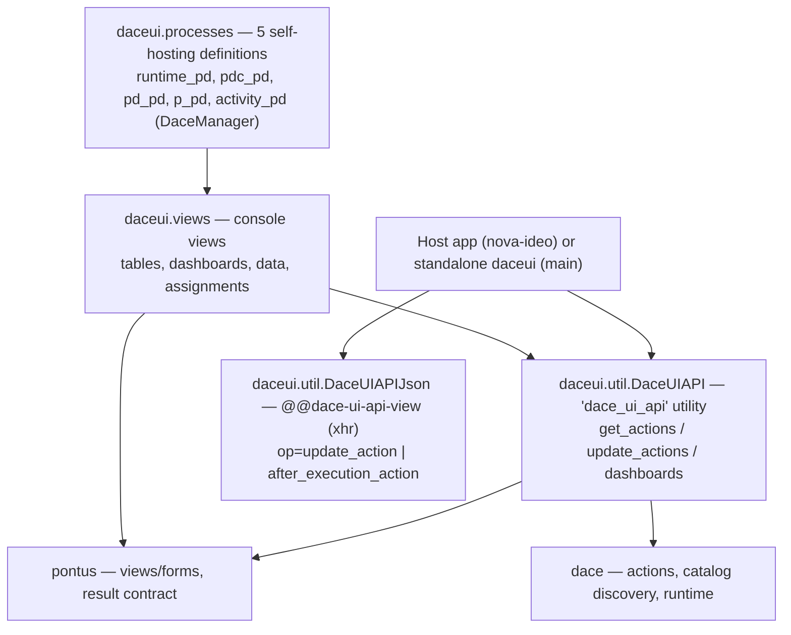
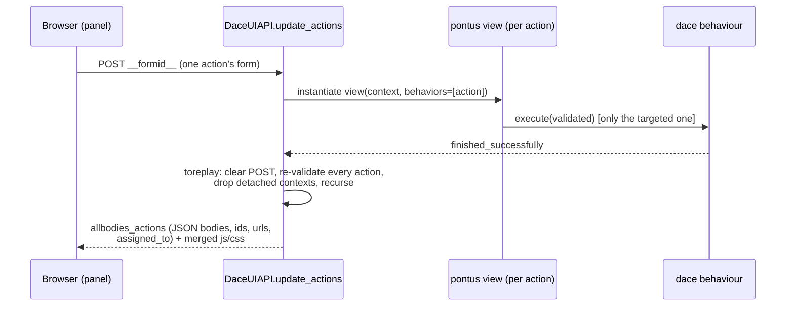

# daceui — architecture and design

*Design document, Phase 2 of the modernisation roadmap. Describes the layer **as it is** in the legacy code base (Python 3.6 era). French version: [`../fr/architecture.md`](../fr/architecture.md).*

## 1. What daceui is

daceui is two things at once:

1. **The administration console of the dace engine — built as dace processes.** The console's own screens (running processes, dashboards, definitions, process data, assignments) are declared as five `isUnique` process definitions carrying the discriminator `'DaceManager'`; their activities hold `automatic` actions (which, per pontus semantics, compose the index pages), bound to pontus views through `DEFAULTMAPPING_ACTIONS_VIEWS`. The engine manages itself with itself.
2. **The ajax action-panel service** (`DaceUIAPI`, registered as the `dace_ui_api` utility): the machinery that collects the applicable actions of a set of contexts, renders each action's view body, executes the one targeted by a POST, and *replays* the whole panel afterwards. This is the service nova-ideo consumes for every action panel it renders.

## 2. The action-panel engine (`DaceUIAPI`)

The heart is the pair `get_actions` / `update_actions`:

- **`get_actions(contexts, request, process_or_id=None, ...)`** collects `(context, action)` pairs via `getAllBusinessAction`, optionally narrowed to a process id or to one *instance* (`action.process is process`).
- **`update_actions`** drives the panel round-trip (`_ajax_views`): for each pair, take the mapped view (`DEFAULTMAPPING_ACTIONS_VIEWS`), instantiate it bound to that single action; if the POST's `__formid__` targets it, *run* it (the behaviour executes); otherwise only collect its js/css requirements. Each action yields an entry of `allbodies_actions`: a JSON-encoded body, a composed id (`behavior_id + action_oid + '_' + context_oid`), the two ajax URLs and the assignment list.

Two behaviours worth naming:

- **The replay.** When the executed view finishes successfully, the whole action set is *replayed* — every action re-validated (contexts whose `__parent__` vanished are dropped), the panel re-rendered in the post-execution state, and the fresh bodies merged with the pre-execution resources. The UI never shows a stale panel.
- **The lost-action error.** A valid `__formid__` that updated nothing produces the (French-authored) "Action non realisee" `ViewError`: the user lost the right meanwhile, or another user holds the dace lock.

`get_action_body` renders a single action's view (unwrapped by default — the modal/inline case); `action_infomrations` (the historical spelling, kept: renaming is an API change for Phase 3) composes the ids and the two ajax URLs, honouring a per-request `ajax_api` override — which is how a host application points the panel callbacks at its own endpoint.

## 3. The xhr endpoint (`@@dace-ui-api-view`)

`DaceUIAPIJson` (on any `Entity`, `xhr=True`, JSON renderer) dispatches on the `op` parameter:

- `update_action` — return the rendered body of one action, resolved by `action_uid` **or**, for virtual start actions, recomputed from the triple `pd_id`/`action_id`/`behavior_id` through `pd.start_process(...)` (`_get_start_action`);
- `after_execution_action` — validate then `after_execution` (the dace unlock) — the callback fired when a panel form is abandoned.

## 4. The self-hosting console

`processes.py` declares five `isUnique` definitions (discriminator `'DaceManager'`, Admin-only role validation): `runtime_pd` (running processes + dashboard), `pdc_pd` (the definition container), `pd_pd` (one definition: details, dashboard, instances), `p_pd` (one process: details, dashboard, manipulated data, actions to do), `activity_pd` (assign an activity/action to users — the only writing actions, `set_assignment`). The dashboards' actions override `url()` to inject `coordinates=main`.

`views.py` binds them: paginated, sortable process tables (`calculatePage`: `page<tabid>`/`number<tabid>` params, 7 rows by default; a process without work-items counts as *blocked*), dygraph dashboards over `statistic_processes`/`statistic_dates`, the definitions grouped by discriminator (reusing pontus's `NavBarPanel` for each), the **process cockpit** — its definition's actions, its manipulated data over `execution_context.all_classified_involveds()` (current vs history), its actions-to-do over `all_active_involveds` — and the assignment forms (Select2 over the site users). The module ends with the explicit `DEFAULTMAPPING_ACTIONS_VIEWS.update(...)` (the author's own comment: "un decorateur c'est mieux!").

## 5. Standalone mode

`daceui.main` is a complete WSGI application (substanced root, the translation dirs of the whole stack, static assets): daceui can run alone as the engine's administration UI, which is also how its historical demos worked.

## 6. Reading map

| To understand… | Read |
|---|---|
| the action-panel engine & the replay | `util.py` (`DaceUIAPI._ajax_views`, `update_actions`) |
| the ajax endpoint | `util.py` (`DaceUIAPIJson`) |
| the self-hosting console | `processes.py`, then `views.py` |
| pagination & dashboards | `util.py` (`calculatePage`, `update_processes`, `statistic_*`) |
