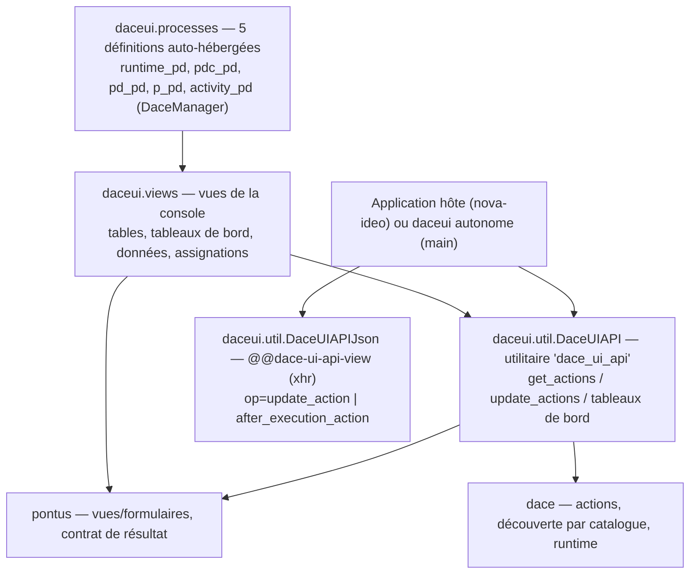
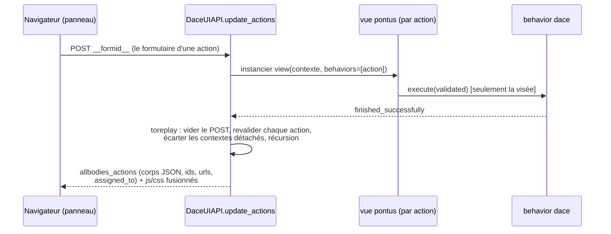

# daceui — architecture et conception

*Document de conception, phase 2 de la feuille de route de modernisation. Décrit la couche **telle qu'elle est** dans la base legacy (ère Python 3.6). English version: [`../en/architecture.md`](../en/architecture.md).*

## 1. Ce qu'est daceui

daceui est deux choses à la fois :

1. **La console d'administration du moteur dace — construite comme des processus dace.** Les écrans de la console (processus en cours, tableaux de bord, définitions, données des processus, assignations) sont déclarés comme cinq définitions de processus `isUnique` portant le discriminateur `'DaceManager'` ; leurs activités portent des actions `automatic` (qui, dans la sémantique pontus, composent les pages d'index), liées aux vues pontus via `DEFAULTMAPPING_ACTIONS_VIEWS`. Le moteur se gère avec lui-même.
2. **Le service ajax des panneaux d'actions** (`DaceUIAPI`, enregistré comme utilitaire `dace_ui_api`) : la machinerie qui collecte les actions applicables d'un ensemble de contextes, rend le corps de la vue de chaque action, exécute celle visée par un POST, et *rejoue* le panneau entier ensuite. C'est le service que nova-ideo consomme pour tous les panneaux d'actions qu'il affiche.

## 2. Le moteur des panneaux d'actions (`DaceUIAPI`)

Le cœur est la paire `get_actions` / `update_actions` :

- **`get_actions(contexts, request, process_or_id=None, ...)`** collecte des paires `(contexte, action)` via `getAllBusinessAction`, éventuellement restreintes à un id de processus ou à une *instance* précise (`action.process is process`).
- **`update_actions`** pilote l'aller-retour du panneau (`_ajax_views`) : pour chaque paire, prendre la vue mappée (`DEFAULTMAPPING_ACTIONS_VIEWS`), l'instancier liée à cette seule action ; si le `__formid__` du POST la vise, l'*exécuter* (le behavior s'exécute) ; sinon ne collecter que ses besoins js/css. Chaque action produit une entrée de `allbodies_actions` : un corps encodé JSON, un id composé (`behavior_id + oid_action + '_' + oid_contexte`), les deux URL ajax et la liste d'assignation.

Deux comportements à nommer :

- **Le rejeu.** Quand la vue exécutée s'achève avec succès, l'ensemble des actions est *rejoué* — chaque action revalidée (les contextes dont le `__parent__` a disparu sont écartés), le panneau re-rendu dans l'état post-exécution, et les corps frais fusionnés avec les ressources d'avant exécution. L'interface ne montre jamais un panneau périmé.
- **L'erreur d'action perdue.** Un `__formid__` valide qui n'a rien mis à jour produit la `ViewError` « Action non realisee » (rédigée en français) : l'utilisateur a perdu le droit entre-temps, ou un autre utilisateur détient le verrou dace.

`get_action_body` rend la vue d'une seule action (déballée par défaut — le cas modal/en ligne) ; `action_infomrations` (l'orthographe historique, conservée : la renommer est un changement d'API pour la phase 3) compose les ids et les deux URL ajax, en honorant une surcharge `ajax_api` par requête — c'est ainsi qu'une application hôte pointe les rappels du panneau vers son propre endpoint.

## 3. L'endpoint xhr (`@@dace-ui-api-view`)

`DaceUIAPIJson` (sur toute `Entity`, `xhr=True`, rendu JSON) dispatch sur le paramètre `op` :

- `update_action` — retourne le corps rendu d'une action, résolue par `action_uid` **ou**, pour les actions de départ virtuelles, recalculée depuis le triplet `pd_id`/`action_id`/`behavior_id` via `pd.start_process(...)` (`_get_start_action`) ;
- `after_execution_action` — valider puis `after_execution` (le déverrouillage dace) — le rappel déclenché quand un formulaire de panneau est abandonné.

## 4. La console auto-hébergée

`processes.py` déclare cinq définitions `isUnique` (discriminateur `'DaceManager'`, validation de rôle Admin seul) : `runtime_pd` (processus en cours + tableau de bord), `pdc_pd` (le conteneur des définitions), `pd_pd` (une définition : détails, tableau de bord, instances), `p_pd` (un processus : détails, tableau de bord, données manipulées, actions à réaliser), `activity_pd` (assigner une activité/action à des utilisateurs — les seules actions écrivantes, `set_assignment`). Les actions des tableaux de bord surchargent `url()` pour injecter `coordinates=main`.

`views.py` les lie : tables de processus paginées et triables (`calculatePage` : paramètres `page<tabid>`/`number<tabid>`, 7 lignes par défaut ; un processus sans work-items compte comme *bloqué*), tableaux de bord dygraph via `statistic_processes`/`statistic_dates`, les définitions groupées par discriminateur (en réutilisant le `NavBarPanel` de pontus pour chacune), le **cockpit d'un processus** — les actions de sa définition, ses données manipulées via `execution_context.all_classified_involveds()` (courantes vs historique), ses actions à réaliser via `all_active_involveds` — et les formulaires d'assignation (Select2 sur les utilisateurs du site). Le module se clôt sur le `DEFAULTMAPPING_ACTIONS_VIEWS.update(...)` explicite (commentaire de l'auteur lui-même : « un decorateur c'est mieux! »).

## 5. Mode autonome

`daceui.main` est une application WSGI complète (racine substanced, les répertoires de traduction de toute la pile, les ressources statiques) : daceui peut tourner seul comme interface d'administration du moteur — c'est aussi ainsi que fonctionnaient ses démonstrations historiques.

## 6. Carte de lecture

| Pour comprendre… | Lire |
|---|---|
| le moteur des panneaux et le rejeu | `util.py` (`DaceUIAPI._ajax_views`, `update_actions`) |
| l'endpoint ajax | `util.py` (`DaceUIAPIJson`) |
| la console auto-hébergée | `processes.py`, puis `views.py` |
| pagination et tableaux de bord | `util.py` (`calculatePage`, `update_processes`, `statistic_*`) |

## Le harnais de tests (phase 3 / M3, 07/2026)

`daceui/testing.py` construit une application réelle (substanced +
dace + pontus + daceui) pour des tests fonctionnels — la première
suite de la bibliothèque : les cinq définitions de processus
`DaceManager`, l'utilitaire `dace_ui_api`, `calculatePage`, un rendu
complet de panneau `update_actions`, la surcharge `request.ajax_api`,
et un contrôle HTTP de bout en bout (login SDI puis
`/runtime/@@index`) sur Chameleon 4. Leçon à retenir : pontus et
daceui déclarent chacun un layout par défaut — l'APPLICATION doit
enregistrer le sien (nova-ideo le fait déjà).
